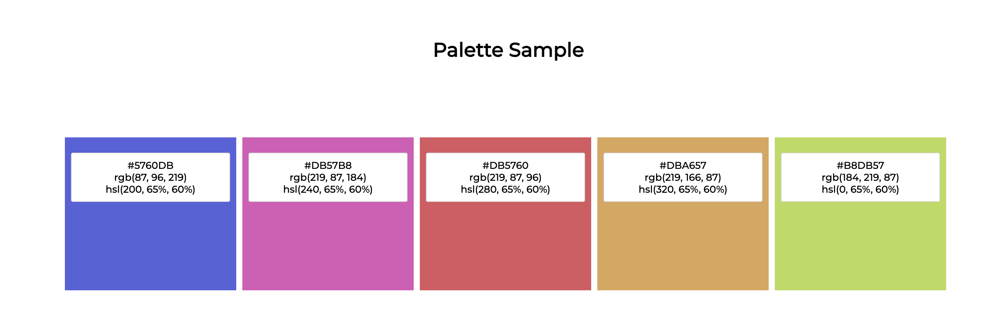

  # Color Palette Generator  

  ## Description

  This is a color Palette Generator . It started as a proof of concept to use CSS variables only for calculating colors. The h, s, l can be changed with a range input. Five colors get created by setting the steps to the next hue in degree (rotation). Finally the created palette can be saved.

  ## Table of Contents

  * [Installation](#Installation)
  * [Usage](#Usage)
  * [License](#license)
  * [Questions](#Questions)

  ***

## An example output

***
  ## Installation

  As it's a little standalone just play with it. A running version can be found here: https://codepen.io/BarbWire/pen/jOQPPYW

  ## Usage

Use the sliders to see how changing one of h,s,l changes the palette. It helped me a lot to understand mathemacial correlations in colors - which I very long just refused to "understand".
... and have fun!

 
<b>License<b>
     
MIT License

Copyright (c) 2023 BarbWire-1

Permission is hereby granted, free of charge, to any person obtaining a copy
of this software and associated documentation files (the "Software"), to deal
in the Software without restriction, including without limitation the rights
to use, copy, modify, merge, publish, distribute, sublicense, and/or sell
copies of the Software, and to permit persons to whom the Software is
furnished to do so, subject to the following conditions:

The above copyright notice and this permission notice shall be included in all
copies or substantial portions of the Software.

THE SOFTWARE IS PROVIDED "AS IS", WITHOUT WARRANTY OF ANY KIND, EXPRESS OR
IMPLIED, INCLUDING BUT NOT LIMITED TO THE WARRANTIES OF MERCHANTABILITY,
FITNESS FOR A PARTICULAR PURPOSE AND NONINFRINGEMENT. IN NO EVENT SHALL THE
AUTHORS OR COPYRIGHT HOLDERS BE LIABLE FOR ANY CLAIM, DAMAGES OR OTHER
LIABILITY, WHETHER IN AN ACTION OF CONTRACT, TORT OR OTHERWISE, ARISING FROM,
OUT OF OR IN CONNECTION WITH THE SOFTWARE OR THE USE OR OTHER DEALINGS IN THE
SOFTWARE.. 
    

  
  
    

    
    
  
  ## Questions

  If you have any questions about the project you can reach out to me on GitHub with the information below. 

  >GitHub : [BarbWire-1](https://github.com/BarbWire-1)

  